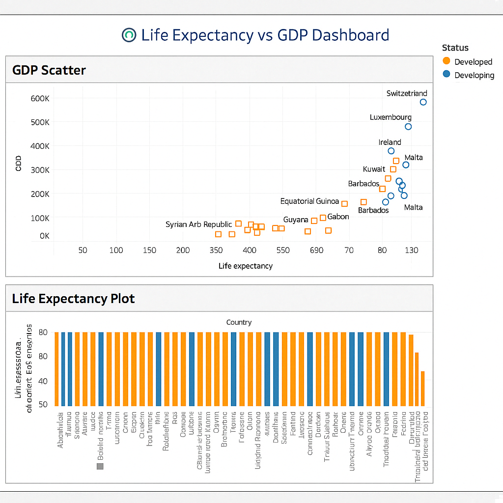

# 🌍 Life Expectancy vs GDP Dashboard

This project presents an interactive Tableau dashboard that explores the relationship between life expectancy and GDP across countries.

## 📊 Dashboard Summary
- **X-Axis:** Life Expectancy
- **Y-Axis:** GDP (Log Scale)
- **Color:** Country Status (Developed vs Developing)
- **Tooltip:** Country, Status, GDP, Life Expectancy
- **Interactivity:** Filter by country status

## 🧭 Insights
- Developed countries generally have higher life expectancy and GDP.
- A log scale was used to spread dense data.
- The dashboard includes sorting and tooltips for clarity.

## 📁 Project Structure
```
life-expectancy-gdp-dashboard/
├── data/                         # Raw dataset (add your CSV here)
├── output/
│   └── final_dashboard_image.png
├── tableau/
│   └── dashboard_screenshot.png
├── README.md
```

## 📸 Dashboard Preview


## 🚀 Author
**Karim Elsayed**  
Email: info.karimelsayed@gmail.com  
GitHub: [InfoKarim](https://github.com/InfoKarim)
